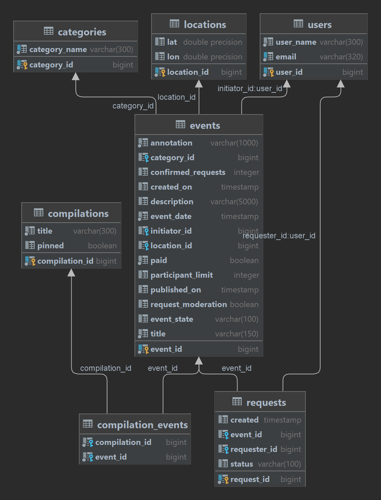

# Explore with me
### Основной сервис "main-service"
API основного сервиса разделен на три части. Первая — публичная, доступна без регистрации любому пользователю сети. 
Вторая — закрытая, доступна только авторизованным пользователям. Третья — административная, для администраторов сервиса.

Доступна следующая функциональность:
###  Функции публичного API
Публичный API предоставляет возможности поиска и фильтрации событий.
1. Сортировка списка событий может быть организована либо по количеству просмотров, которое запрашивается в сервисе статистики, 
либо по датам событий.
2. При просмотре списка событий возвращается только краткая информация о мероприятиях.
3. Просмотр подробной информации о конкретном событии настроено отдельно (через отдельный эндпоинт).
4. Каждое событие относиться к одной категории, которые зафиксированы в приложении.
5. Есть возможность получения списка всех имеющихся категорий и подборок событий (такие подборки составляют администраторы ресурса).
6. Каждый публичный запрос для получения списка событий или полной информации о мероприятии фиксируется сервисом статистики.

###  Функции API для авторизованных пользователей
Закрытая часть API призвана реализовать возможности зарегистрированных пользователей продукта.
1. Авторизованные пользователи имеют возможность добавлять в приложение новые мероприятия, редактировать их и просматривать после добавления.
2. Авторизованные пользователи могут подать заявку на участие в интересующих мероприятиях. 
3. Автор мероприятия имеет возможность подтверждать заявки, которые отправили другие пользователи сервиса.
4. Пользователи могут поставить like/dislike мероприятию, в котором они принимали участие.

###  Функции API для администратора
Административная часть API предоставляет возможность настройки и обслуживания сервиса.
1. Администратор может добавлять, изменять и удалять категории для событий.
2. Администратор может добавлять, удалять и закреплять на главной странице подборки мероприятий.
3. Администратор может осуществлять модерацию событий, размещённых пользователями, — публикация или отклонение.
4. Администратор может управлять пользователями — добавлять, просматривать и удалять.

### Техническая составляющая:

Сервис запускается на 8080 порту.
Включает в себя базу данных PostgreSQL 

Подключение БД:
- POSTGRES_DB=explore_db
- POSTGRES_USER=sa
- POSTGRES_PASSWORD=root

Дополнительный модуль "stat-client".

Отдельный модуль, через который основной сервис обращается к модулю статистики.

