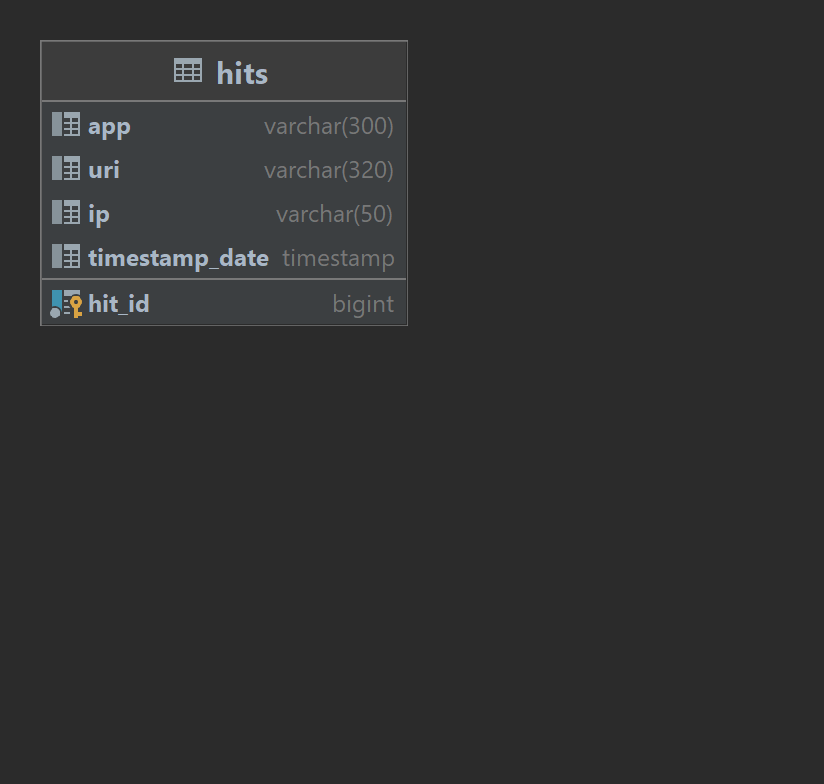

# Explore with me
### Сервис статистики "stat-service"
Второй сервис, статистики, призван собирать информацию. 

Во-первых, о количестве обращений пользователей к спискам событий и, во-вторых, о количестве запросов к подробной информации о событии. На основе этой информации должна 
формироваться статистика о работе приложения.

Функционал сервиса статистики:

- запись информации о том, что был обработан запрос к эндпоинту API.
- предоставление статистики за выбранные даты по выбранному эндпоинту.

### Техническая составляющая:

Сервис запускается на 9090 порту.
Включает в себя базу данных PostgreSQL 

Подключение БД:
- POSTGRES_DB=stat_explore_db
- POSTGRES_USER=sa
- POSTGRES_PASSWORD=root

